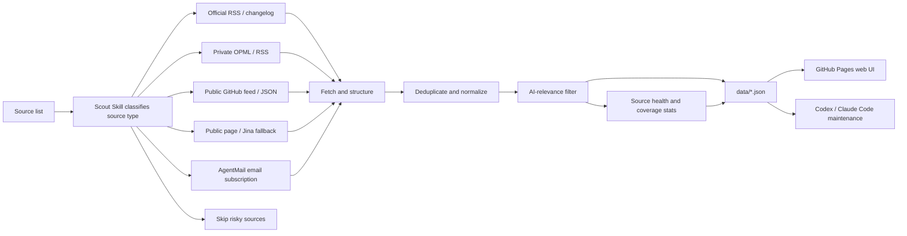

<div align="center">

# AI News Radar

## 24h AI Updates Radar｜Scout Skill

**Scout Skill helps you find the thoroughbreds among a pile of AI sources.**

[](https://learnprompt.github.io/ai-news-radar/)
[](https://github.com/LearnPrompt/ai-news-radar/actions/workflows/update-news.yml)
[](LICENSE)

You read the updates. Scout Skill decides which sources are worth tracking. Its Chinese display name is 伯乐Skill.

[Live site](https://learnprompt.github.io/ai-news-radar/) · [中文](README.md) · [Scout Skill](skills/ai-news-radar/README.md) · [Source strategy](docs/SOURCE_COVERAGE.md)

</div>

---

## What is this?

AI News Radar is an auto-updating 24h AI updates radar.

Readers open the web page and scan the last 24 hours of AI, model, developer-tool, and tech-ecosystem updates. Maintainers can fork this repo and connect their own OPML/RSS, public feeds, static pages, or AgentMail inbox intelligence. Codex / Claude Code-style agents can use the in-repo **Scout Skill** to keep judging sources, maintaining fetch logic, and deploying GitHub Pages.

The real point of this project is not “one more news website”.

Its core is **Scout Skill**: not to make you chase more information, but to help you find the thoroughbreds among a pile of sources. Decide first which sources are worth tracking long term, which sources fit RSS/OPML, which ones should stay private or advanced, and which noisy sources should not enter the default radar.

> This public repo is prepared for release. It does not include the author's private RSS subscription file, API keys, cookies, email bodies, or any private credentials.

## Why Scout Skill?

Good updates are scattered everywhere. Bad information never stops coming.

Official blogs publish one piece. GitHub changelogs publish another. Someone leaks an early signal on X. Aggregators keep reposting the same story. You think you are tracking the frontier, but most days you are doing three things: opening dozens of pages, filtering duplicates, and guessing what is actually worth reading.

Scout Skill handles the first pass: **which sources are thoroughbreds, and which ones are just noise**.

It distinguishes which sources fit RSS, which can be read from public GitHub JSON, which need Jina fallback, which should only come through AgentMail email subscriptions, and which need a custom parser.

So AI News Radar is not just fetching information back.

It is closer to a lightweight news pipeline: source judgement, fetching, deduplication, AI-relevance filtering, source-health status, and static web publishing. Once deployed, it does not consume model quota.

## What it can do now

- Track official AI nodes, including OpenAI News, OpenAI Codex Changelog, OpenAI Skills, Anthropic, Google DeepMind, Google AI, Hugging Face, GitHub AI, and more
- Read high-signal public newsletters and daily digests, such as AI Breakfast
- Read feeds exposed by websites themselves, such as Follow Builders for X builders, Anthropic Engineering, Claude Blog, and AI podcasts
- Connect multiple public aggregator sources at the same time to cover blind spots missed by ordinary official feeds
- Support OPML/RSS batch import
- Support AgentMail email subscriptions for high-quality AI digests
- Output a 24h two-view UI: `AI-focused` and `All`
- Render bilingual titles and site groups
- Work well with Feishu documents, with added WaytoAGI open-source community latest-day and last-7-days changes

## How it works



AI News Radar borrows useful techniques from modern news products. It is not about piling up sources. Dumping tens of thousands of items at once is the same as being useless, so the project turns news handling into a stable pipeline: fetch, deduplicate, filter, add status, and generate a static site.

It stays lightweight while keeping the system stable. The public version does not require users to configure an LLM API key, and it does not depend on login state, cookies, X API access, or email. When those advanced abilities are needed, Scout Skill can connect them through GitHub Secrets or local environment variables.

## Quick start

Readers do not need to install anything. Open the live site directly.

To fork and customize your own version locally:

```bash
git clone https://github.com/LearnPrompt/ai-news-radar.git
cd ai-news-radar
python3 -m venv .venv
source .venv/bin/activate
pip install -r requirements.txt
python scripts/update_news.py --output-dir data --window-hours 24
python -m http.server 8080
```

Open:

```text
http://localhost:8080
```

If you have your own OPML:

```bash
cp feeds/follow.example.opml feeds/follow.opml
# Put your own subscriptions into feeds/follow.opml. Do not commit this file.
python scripts/update_news.py --output-dir data --window-hours 24 --rss-opml feeds/follow.opml
```

## Tutorial for agents

If you want Codex / Claude Code / OpenClaw / Hermes to help you build your own version, say:

```text
Use Scout Skill for AI News Radar. Ask me for my source list first, then decide whether each source should use RSS, public feeds, static pages, Jina fallback, AgentMail email, or be skipped. The goal is to deploy a serverless AI daily news site that updates automatically with GitHub Actions. Do not commit any API keys, cookies, tokens, or private email content into the repo.
```

The in-repo Skill lives at:

- `skills/ai-news-radar/README.md`
- `skills/ai-news-radar/SKILL.md`

When a new agent takes over validation, read these first:

- `README.md`
- `README.en.md`
- `docs/GPT_HANDOFF.md`
- `docs/SOURCE_COVERAGE.md`
- `docs/V2_PRODUCT_BRIEF.md`

## GitHub Actions updates

`.github/workflows/update-news.yml` is already configured.

- Runs every 30 minutes by default
- Automatically generates and commits `data/*.json`
- Decodes `FOLLOW_OPML_B64` into `feeds/follow.opml` when configured
- Generates a redacted email summary when `EMAIL_DIGEST_ENABLED=1`, `AGENTMAIL_API_KEY`, and `AGENTMAIL_INBOX_ID` are set
- Commits `data/email-digest.json` only when `EMAIL_DIGEST_PUBLISH=1` is also explicitly set

By default, the core pipeline requires no API keys.

## License

[MIT](LICENSE)
